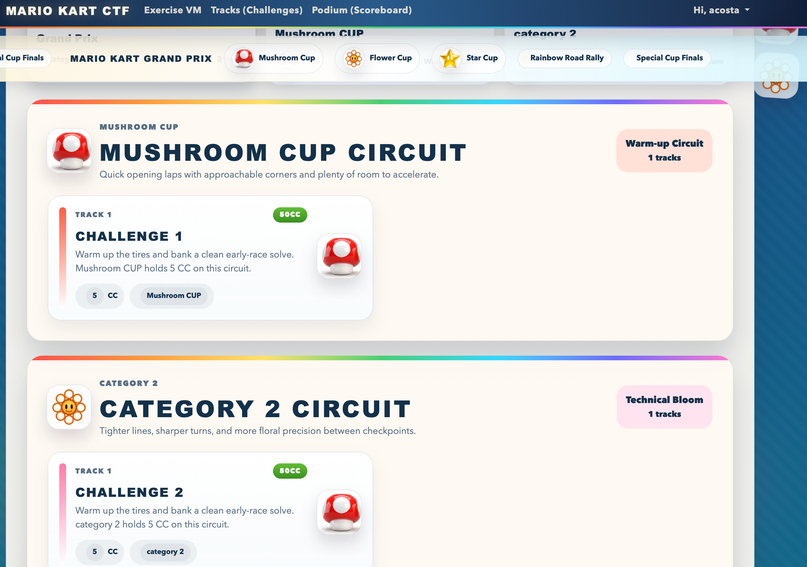

# CTFd Mario Kart Theme

A Mario Kart inspired theme for CTFd with custom layouts for the homepage, challenges, scoreboard, teams, users, notifications, and settings pages.

## Screenshots




## Prerequisites

- Node.js 18+ recommended
- npm
- A CTFd instance where you can install a custom theme

## Install Dependencies

```bash
npm install
```

## Build The Theme

```bash
npm run build
```

This command:

- builds the Vite assets into `static/`
- creates an installable `mariokart-theme/` directory
- generates `mariokart-theme.zip`

## Install In CTFd

1. Run `npm install` if you have not installed dependencies yet.
2. Run `npm run build` from the project root.
3. Copy the generated `mariokart-theme/` directory, or unzip `mariokart-theme.zip`, into your CTFd `themes/` directory.
4. Restart CTFd so the new theme is detected.
5. Select the theme in your CTFd admin configuration if your deployment does not pick it up automatically.

After installation, the deployed theme directory should look like this inside CTFd:

```text
CTFd/
  themes/
    mariokart-theme/
      assets/
      static/
      templates/
      theme.json
```

## Development

Use watch mode while editing assets:

```bash
npm run dev
```

Theme source files live in:

- `assets/`
- `templates/`
- `theme.json`

When you are ready to package a fresh installable build, run `npm run build` again.